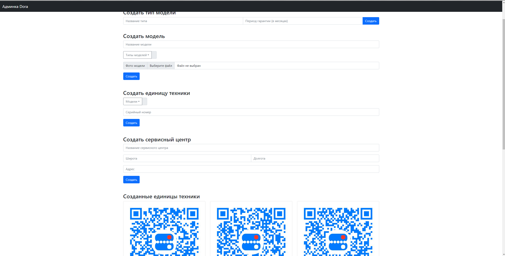

## Backend-часть для приложения Dora

### Описание

В данном проекте представлены методы для работы всех ролей приложения. todo

### Веб-часть

С помощью веб-части администратор может добавлять новых производителей,
производитель создавать новые модели товаров, типы товаров, сервисные центры.
Сервисные центры могут отвечать на заявки гарантийного обслуживания.

  
